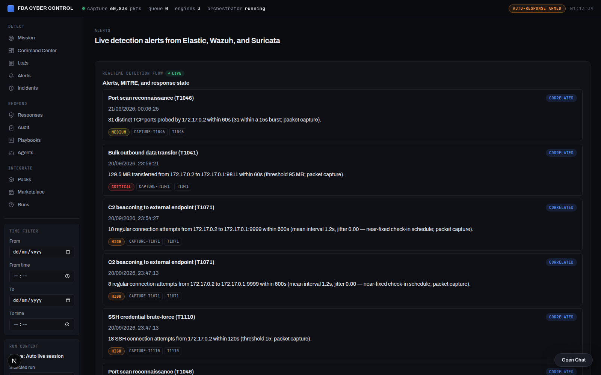
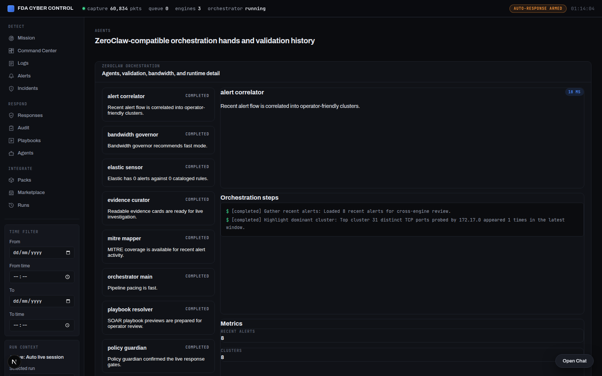
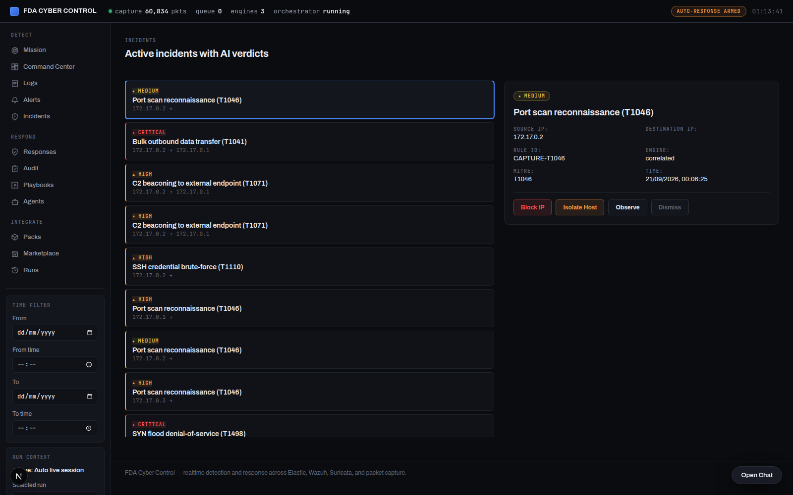
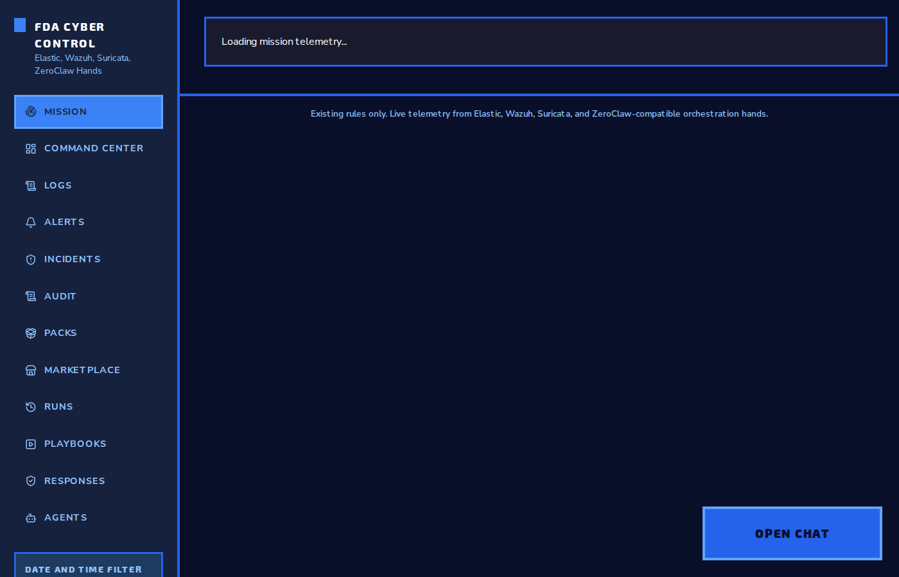
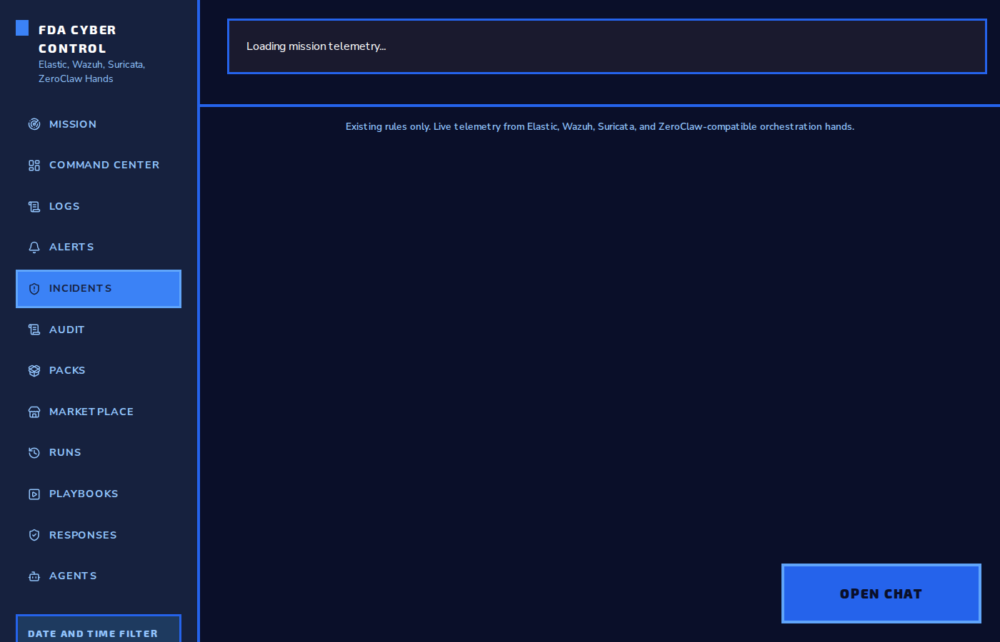
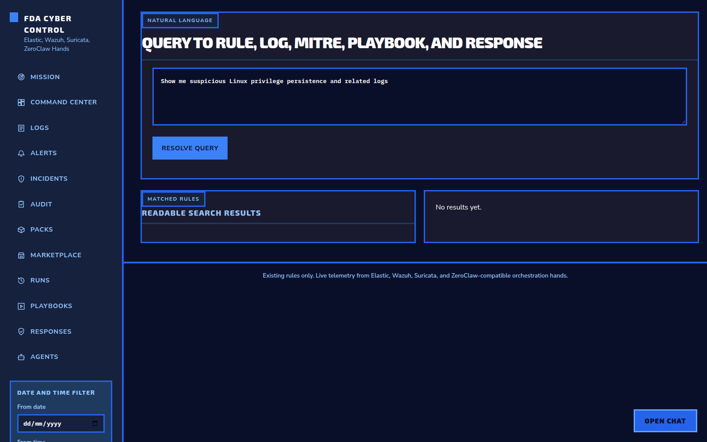
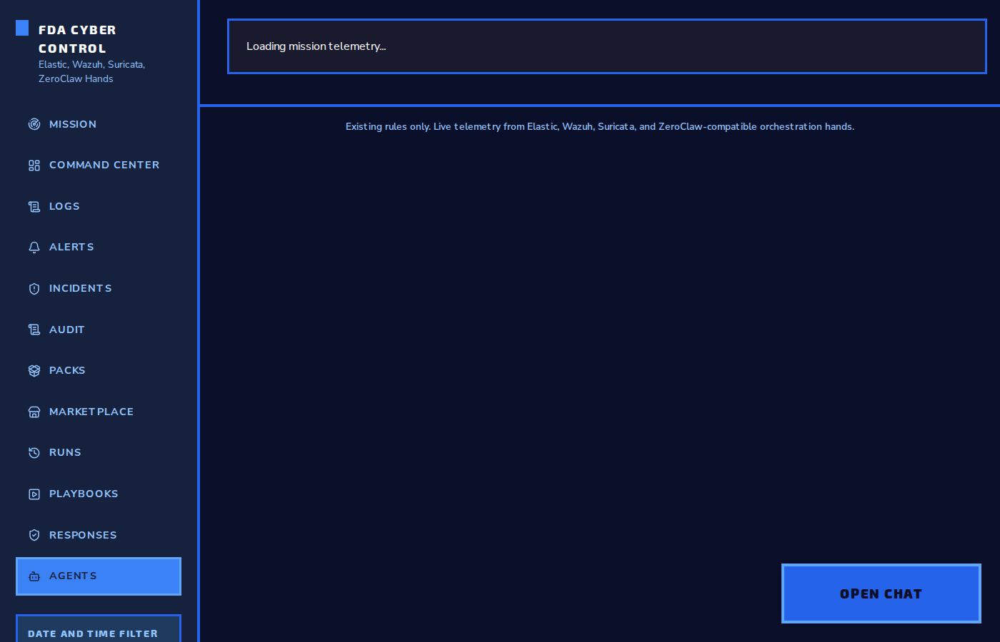

# FDA Cyber Control

Single-box IDS/IPS with AI-driven triage and nftables enforcement. Detects real network traffic, correlates across engines, explains in plain English, and enforces containment on the kernel.










## What It Does

1. **Real packet capture** — Go agent captures raw traffic via AF_PACKET (eBPF ready)
2. **Real log ingestion** — journald, auditd, syslog, nginx, Windows Event Log
3. **Detection** — 6000+ rules (Sigma, Elastic, Wazuh, Panther) with BM25 search
4. **AI triage** — the response engine runs NVIDIA LLM triage on every high/critical alert (rule-based fallback without a key); verdicts land on the incident card and in the Audit Log
5. **Enforcement** — nftables set-based blocks, real rate-limit+drop throttling, account locks; TTL-based auto-rollback survives restarts
6. **ZeroClaw agents** — 18 TOML-configured hands run deterministic logic on real events

## Architecture

```
[Go Agent: AF_PACKET] -> [FastAPI: store_event()] -> [SQLite: zstd-compressed]
                                                    |
                                [ZeroClaw Runtime: 18 hands on schedule]
                                        |
                    [NVIDIA LLM: AI triage]    [nftables: enforcement]
                                        |
                            [React dashboard: incidents + audit]
```

## Installation

### Prerequisites

- Python 3.10+
- Go 1.25+ (for the capture agent)
- libpcap-dev (compile-time for Go agent)
- nftables (kernel module, already present on most Linux)
- NVIDIA API key (optional, enables AI triage)

### 1. Install

```bash
./scripts/fetch_rule_corpora.sh   # fetch detection rule corpora (Sigma, Elastic, Wazuh, Panther)
./install.sh                      # venv, deps, frontend build, rule indexing
```

The fetcher pulls the gitignored rule corpora from their upstream repos (shallow clone, tarball fallback) and is safe to re-run. `install.sh` then indexes every corpus into the rule catalog — Sigma, Elastic, Wazuh, and Panther engines all appear in the rule explorer.

### 2. Configure

```bash
cp .env.example .env
# Edit .env:
#   NVIDIA_API_KEY=your-key-here    (optional, enables AI triage)
#   FDA_RESPONSE_DRY_RUN=true        (default: true, set false for live enforcement)
#   FDA_RESPONSE_TTL_SECONDS=1800   (enforcement TTL, default 30 minutes)
```

Get an NVIDIA API key at https://integrate.api.nvidia.com/

### 3. Start

```bash
./fda start
```

This starts:
- The API server on http://localhost:8000
- The ZeroClaw runtime (18 agent hands)
- The event receiver (Go agent HTTP endpoint on http://localhost:8001)
- The retention auto-prune thread

### 4. Run the Go capture agent

In another terminal (requires root for AF_PACKET):

```bash
cd agent
go build -o fda-agent .
sudo setcap cap_net_raw=ep fda-agent   # packet capture without running as root
./fda-agent
```

The agent captures packets on the default interface, **excludes its own API traffic** (no feedback loop), and POSTs decoded events to the API at `FDA_API_URL` (default http://127.0.0.1:8000/api/events/ingest). Point it at your server with `FDA_API_URL=http://<host>:<port>` and choose the interface with `FDA_AGENT_INTERFACE` (default `lo`).

## Multi-host deployment

One server, N sensors. Build the image once, run the API everywhere you want a dashboard, run the agent on everything you want watched.

```bash
# 1. Server host (dashboard + detection + AI + enforcement)
docker compose -f docker-compose.multihost.yml up -d

# 2. Each sensor host — points at the server, captures its own traffic
FDA_API_URL=http://<server-ip>:8000 FDA_AGENT_INTERFACE=eth0 \
  docker compose -f docker-compose.multihost.yml --profile sensor up -d fda-agent
```

The sensor agent (Go, AF_PACKET, needs `NET_RAW`) batches events, excludes its own POST traffic, and **buffers up to 50k events during server outages** instead of dropping them. Scan-detection is tunable per deployment via env vars (see Configuration).

### Bare-metal sensors (no Docker)

```bash
sudo apt install -y golang && cd agent && go build -o ../bin/fda-agent .
sudo setcap 'cap_net_raw=+ep' bin/fda-agent     # capture without root
FDA_API_URL=http://<server-ip>:8000 FDA_AGENT_INTERFACE=eth0 ./bin/fda-agent
```

## Screenshots

### Dashboard

The main mission control view showing live telemetry, detection stats, and system status.


### Alerts

Live alert feed from Elastic, Wazuh, and Suricata with severity indicators and MITRE technique mapping.


### Agents

ZeroClaw agent hands status showing 18 parallel execution channels.


### Incidents

Correlated incident view combining multiple detection engines into unified incident timelines.


### Audit Log

Complete audit trail of all AI decisions and enforcement actions with rollback status.


### Command Center

Operational command center with detection metrics, run history, and system health.


### Detection Rules

Searchable rule explorer with BM25 full-text search across 6000+ detection rules.


### MITRE Playbooks

MITRE ATT&CK playbook browser with live detection context and executable response commands.


## API Endpoints

### Events

```
POST /api/events/ingest         Ingest captured events (single or batch)
GET  /api/events/status         Event receiver status
```

### AI Triage

```
GET  /api/health                 Health check + config status
```

### Dashboard

```
GET  /                          React frontend (Command Center)
```

## Configuration (.env)

| Variable | Default | Purpose |
|----------|---------|---------|
| `FDA_PORT` | 8000 | API server port |
| `FDA_AGENT_PORT` | 8001 | Go agent HTTP endpoint |
| `NVIDIA_API_KEY` | (empty) | Enables AI triage |
| `NVIDIA_MODEL` | meta/llama-3.2-11b-vision-instruct | LLM model (benchmarked for strict-JSON triage; `nvidia/nemotron-3-super-120b-a12b` is the heavier fallback) |
| `FDA_RESPONSE_DRY_RUN` | true | Dry-run mode: decisions recorded, nothing enforced |
| `FDA_RESPONSE_TTL_SECONDS` | 1800 | Enforcement TTL (auto-rollback) |
| `FDA_RESPONSE_INTERVAL_SECONDS` | 10 | Response engine cycle interval |
| `FDA_RESPONSE_MAX_ALERTS` | 10 | Alerts triaged per cycle |
| `FDA_RESPONSE_MIN_CONFIDENCE` | 0.5 | Min AI confidence for auto-execution |
| `FDA_SCAN_WINDOW_SEC` | 60 | Port-scan sliding window |
| `FDA_SCAN_PORT_THRESHOLD` | 20 | Distinct TCP ports in window to trigger |
| `FDA_SCAN_BURST_SEC` | 15 | Ports must be touched within this burst |
| `FDA_SCAN_COOLDOWN_SEC` | 300 | Min seconds between alerts per source |
| `FDA_SCAN_SUPPRESS_LOOPBACK` | true | Ignore 127.x→127.x traffic (local chatter) |
| `FDA_AGENT_BATCH_SIZE` | 10 | Agent: events per POST |
| `FDA_AGENT_FLUSH_SECONDS` | 2 | Agent: max seconds before a partial flush |
| `FDA_AGENT_MAX_BUFFERED` | 50000 | Agent: events kept during server outage |
| `RETENTION_HOURS` | 168 | Event retention (7 days) |
| `FDA_ES_TIMEOUT_SECONDS` | 30 | ES query timeout |

## Enforcement Actions

| Action | What it does | Kernel mechanism |
|--------|-------------|-------------------|
| `block_source_ip` | Drops all packets from a source IP | `nftables` set element |
| `block_egress` | Drops all traffic leaving the box to a destination IP | `nftables` egress set |
| `throttle_service` | Rate-limits, drops excess traffic | `nftables limit` + drop rule |
| `isolate_host` / `quarantine_endpoint` | Drops all traffic to/from an IP | dual `nftables` sets |
| `disable_account` | Locks a Linux account | `usermod -L` |
| `observe_only` | Logs only, no enforcement | — |

Every enforcement action has a TTL (default 30 min). After TTL expires, the rollback sweeper removes the rule automatically — including after a restart (expired entries are pruned on boot). Every decision and action is logged to the SQLite store (`control_actions.jsonl` state file) and surfaced in the Audit Log and on the incident card in the UI, in both dry-run and live mode.

## ZeroClaw Agents

18 TOML-configured agent hands run on a schedule:
- `alert_correlator` — clusters alerts by source IP
- `threat_summarizer` — summarizes high/critical alerts
- `response_planner` — checks policy gates before execution
- `policy_guardian` — verifies response policy compliance
- `mitre_mapper` — maps alerts to MITRE ATT&CK techniques
- `validation_agent` — validates rules firing on real events
- `evidence_curator` — collects forensic artifacts
- `playbook_resolver` — resolves MITRE playbook references
- `orchestrator_main` — meta-hand for runtime health

Every hand is real code in `agents/orchestration_engine.py::execute_hand()`. Every hand reads from the unified store, produces findings, and persists context.

## Storage

SQLite with:
- WAL mode (concurrent reads/writes)
- `synchronous=NORMAL` (performance)
- Batch inserts (`BEGIN IMMEDIATE + executemany`)
- zstd compression on raw payloads
- Retention auto-pruning

Expected disk usage: ~50-100 MB/day on a busy network.

## Testing

```bash
make test                  # Python unit tests (pytest)
make test-pipeline         # Integration test (requires sudo for AF_PACKET)
cd agent && go test ./...  # Go agent tests (requires sudo for real capture)
```

## Limitations

- AF_PACKET requires root (or CAP_NET_RAW capability)
- nftables requires root
- AI triage requires a valid NVIDIA API key
- SQLite is single-writer; batch insert is used for throughput
- No horizontal scaling (single-box design)

## Design

See [DESIGN.md](DESIGN.md) for the full design document including the 11 approved design decisions from the design review.

## Internal architecture

- `backend/app/core/orchestrator.py`: Real ZeroClaw runtime that loads TOML hands and executes them on live events published from the event bus.
- `backend/app/core/enforce.py`: Real nftables enforcement with block/throttle/isolate actions, TTL rollback scheduling, and log persistence.
- `agents/orchestration_engine.py`: Python orchestration engine (18 hands) running in-process behind the API; the response engine (`agents/response_engine.py`) handles detect → AI triage → policy-gated enforcement.
- `app_shared/nvidia_ai.py`: Enhanced AI triage using packet context and correlated timeline with NVIDIA API, including a rule-based offline fallback.
- `app_shared/unified_store.py`: SQLite storage with zstd-compressed payloads and batch ingestion.
- `agent/capture/afpacket.go`: Production AF_PACKET capture loop.
- `agent/capture/afpacket.go`: Real packet decoders for Ethernet, IPv4, TCP, and ICMP.
